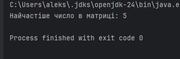

# 🧮 MatrixAnalyzer

Цей проєкт реалізує програму для пошуку **найчастіше повторюваного числа** в матриці розміру `N x M`.

## ✅ Завдання

> Знайти в матриці розміром N x M число, яке повторюється найбільшу кількість разів.

---

## 📌 Опис рішення

- Уся логіка винесена в окремий клас `MatrixAnalyzer`, який містить один **статичний метод**:
   - `findMostFrequentNumber(int[][] matrix)` — повертає найбільш частотне значення.

- Для **оптимізації**:
   - Використовується `HashMap` для підрахунку частот.
   - Обробка матриці — через `Arrays.stream()` без використання циклів.

- **Тестування** винесено в окремий клас `Main`, який лише перевіряє роботу методу.

---

## 🧠 Схема роботи

```text
+-------------+            +----------------------------+
|  Матриця    |  ----->    |   Перетворення в потік     |
+-------------+            +----------------------------+
                                        |
                                        v
                             +----------------------+
                             |  Підрахунок частот   |
                             +----------------------+
                                        |
                                        v
                          +-------------------------------+
                          |  Повернення найчастішого числа |
                          +-------------------------------+
```

## 🧪 Приклад
### Вхідна матриця:
```
5 1 2
5 3 4
5 6 7
```
### Результат:
```
Найчастіше число в матриці: 5
```

## 📁 Структура проєкту
```
src/
├── MatrixAnalyzer.java   // Основна логіка
└── Main.java             // Тестування (main)
```

## 📷 Скриншот прикладу виконання

